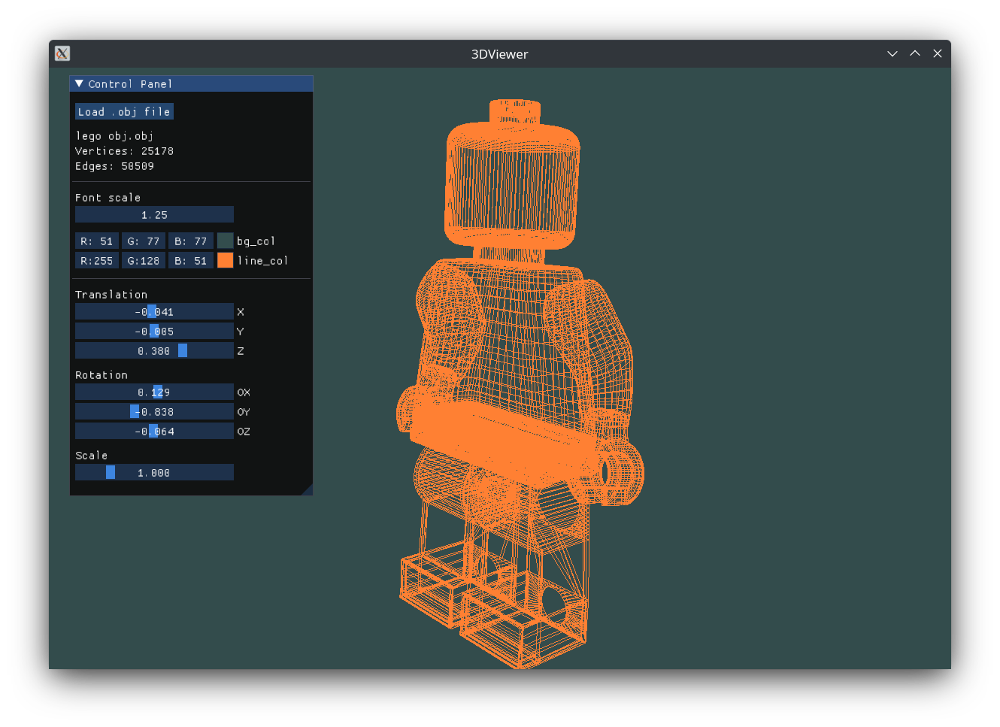

# 3DViewer v1.0
A project for School 21. View `.obj` files as wireframes.



### Building
Requires OpenGL 3.3+ and [GLFW](https://github.com/glfw/glfw) to run.
On Linux, install GLFW and `gtk-devel` (for "open file" dialog window). On Mac, just install GLFW.

__Debian__ (didn't test myself, but should work):
```shell
>$ sudo apt install libglfw3-dev libgtk-3-dev
```
__Fedora__:
```shell
>$ sudo dnf install glfw-devel gtk3-devel
```
__MacOS__:
```shell
>$ mkdir homebrew && curl -L https://github.com/Homebrew/brew/tarball/master | tar xz --strip 1 -C homebrew
>$ brew install glfw
```

Then run `make`.

### Roadmap
- [X] Translate/Rotate/Scale as separate operations on the model
	- Set correct translation/rotation/scale in `t_object`, call `update_view_mat()`, set new MVP matrix uniform
- [ ] Use mouse to rotate the model (optional)
- [X] UI
	- Works. Sort of.
- [X] `.obj` file parsing, loading, correct error handling
- [X] Unit tests for model loading and affine transformations
- [X] Makefile rules: `install`, `uninstall`, `dvi`, `dist`, `tests`, `gcov_report`
